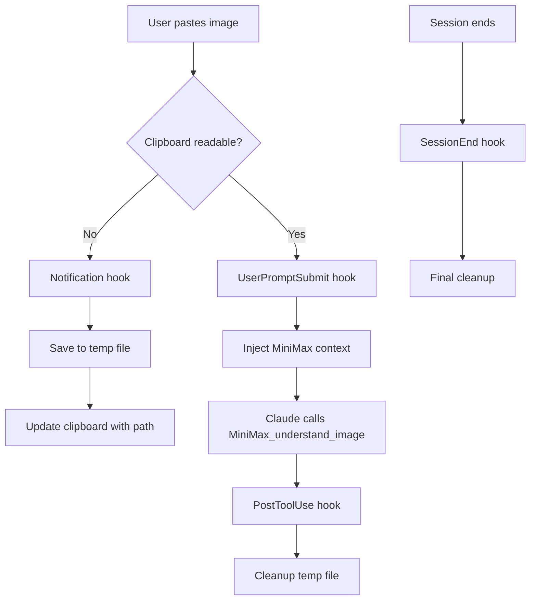

# MiniMax Clipboard Image Analysis for Claude Code

> **Paste. Analyze. Done.**  
> Automatically save and analyze clipboard images using MiniMax's vision capabilities.

[](https://opensource.org/licenses/MIT)
[](https://github.com/oh-my-opencode)

## ✨ Features

- 🖼️ **Zero-friction image analysis** - Just paste, no file saving needed
- 🔄 **Automatic workflow** - Detects clipboard → saves → analyzes → cleans up
- 🎯 **Session isolation** - Multiple sessions don't interfere with each other
- 🧹 **Auto cleanup** - Temporary files removed after analysis
- 💬 **User feedback** - System messages show what's happening
- 🔒 **Race condition safe** - Lock mechanism prevents conflicts

## 🎬 Demo

```
User: [Pastes screenshot]
User: What's in this image?

Claude: 🖼️ Clipboard image detected. Starting MiniMax analysis...

[MiniMax analyzes the image]

Claude: This screenshot shows a web application dashboard with...
```

## 📦 Installation

### Quick Install (Recommended)

```bash
bash <(curl -fsSL https://raw.githubusercontent.com/ComBba/minimax-clipboard-skill/master/scripts/install.sh)
```

### Manual Installation

1. **Install pngpaste** (macOS only):
   ```bash
   brew install pngpaste
   ```

2. **Clone the repository**:
   ```bash
   git clone https://github.com/ComBba/minimax-clipboard-skill.git
   cd minimax-clipboard-skill
   ```

3. **Copy hook files**:
   ```bash
   mkdir -p ~/.claude/hooks
   cp -r hooks/minimax_clipboard_image ~/.claude/hooks/
   chmod +x ~/.claude/hooks/minimax_clipboard_image/hook.py
   ```

4. **Update Claude settings**:
   
   Add to `~/.claude/settings.json`:
   
   ```json
   {
     "hooks": {
       "Notification": [
         {
           "hooks": [
             {
               "type": "command",
               "command": "python3 ~/.claude/hooks/minimax_clipboard_image/hook.py Notification"
             }
           ]
         }
       ],
       "UserPromptSubmit": [
         {
           "hooks": [
             {
               "type": "command",
               "command": "python3 ~/.claude/hooks/minimax_clipboard_image/hook.py UserPromptSubmit"
             }
           ]
         }
       ],
       "PostToolUse": [
         {
           "matcher": "MiniMax_understand_image",
           "hooks": [
             {
               "type": "command",
               "command": "python3 ~/.claude/hooks/minimax_clipboard_image/hook.py PostToolUse"
             }
           ]
         }
       ],
       "SessionEnd": [
         {
           "hooks": [
             {
               "type": "command",
               "command": "python3 ~/.claude/hooks/minimax_clipboard_image/hook.py SessionEnd"
             }
           ]
         }
       ]
     }
   }
   ```

5. **Restart Claude Code**

6. **Verify installation**:
   ```bash
   # Test the hook
   ~/.claude/hooks/minimax_clipboard_image/test-workflow.sh
   ```

## 🚀 Usage

### Basic Workflow

1. **Copy** any image to your clipboard:
   - Screenshot (Cmd+Shift+4 on macOS)
   - Drag image from browser
   - Copy from Preview/Photos
   - Right-click → Copy Image

2. **Paste** in Claude Code (Cmd+V)

3. **Ask** your question or press Enter

4. Claude **automatically analyzes** the image

### Use Cases

#### 📸 Screenshot Analysis

```
[Paste screenshot]
Analyze this UI and suggest improvements
```

#### 📄 OCR / Text Extraction

```
[Paste document scan]
Extract all text from this image and format as markdown
```

#### 🐛 Debugging Visuals

```
[Paste browser screenshot]
Why is the layout broken on mobile?
```

#### 📊 Chart/Diagram Understanding

```
[Paste architecture diagram]
Explain this system architecture and identify potential bottlenecks
```

#### 🎨 Design Review

```
[Paste design mockup]
Compare this with our design system. What's inconsistent?
```

## 🛠️ How It Works

### Architecture



### Event Flow

1. **Notification Event**: When Claude Code can't read clipboard (image paste), the hook saves it to a file
2. **UserPromptSubmit Event**: Injects context telling Claude to use MiniMax_understand_image
3. **PostToolUse Event**: After MiniMax analyzes, cleanup temp files
4. **SessionEnd Event**: Final cleanup when session closes

### Session Isolation

Each Claude session gets its own temp directory:

```
~/.claude/tmp/images/clipboard/
├── ses_abc123/
│   └── clipboard_20260129_220820.png
├── ses_def456/
│   └── clipboard_20260129_221015.png
└── .last_image_ses_abc123
```

This prevents:
- Cross-session file conflicts
- Race conditions in parallel sessions
- Accidental deletion of active images

## 📋 Requirements

- **Operating System**: macOS (uses `pngpaste` and `pbcopy`)
- **Python**: 3.7+ (uses standard library only)
- **Claude Code**: Latest version with hook support
- **MiniMax MCP**: Configured and enabled

## 🔧 Configuration

### Default Settings

The hook uses these defaults:

- **Temp directory**: `~/.claude/tmp/images/clipboard/`
- **Retry attempts**: 5 (for race condition handling)
- **Timeout**: 5 seconds per save attempt
- **Max image size**: Unlimited (MiniMax supports up to 20MB)

### Customization

Edit `hook.py` to customize:

```python
# Configuration
TMP_DIR = Path.home() / ".claude" / "tmp" / "images"
CLIPBOARD_DIR = TMP_DIR / "clipboard"

# Retry logic
for attempt in range(5):  # Change retry count
    result = subprocess.run(
        ["pngpaste", str(filepath)], 
        timeout=5  # Change timeout
    )
```

## 🐛 Troubleshooting

### Image not detected after pasting

**Check clipboard contents:**
```bash
pngpaste test.png && open test.png
```

**Verify hook is registered:**
```bash
grep minimax ~/.claude/settings.json
```

### "pngpaste: command not found"

Install pngpaste:
```bash
brew install pngpaste
```

### Hook not executing

1. Check hook permissions:
   ```bash
   ls -la ~/.claude/hooks/minimax_clipboard_image/hook.py
   # Should be executable: -rwxr-xr-x
   ```

2. Make executable if needed:
   ```bash
   chmod +x ~/.claude/hooks/minimax_clipboard_image/hook.py
   ```

3. Restart Claude Code

### Temp files not cleaned up

Manual cleanup:
```bash
rm -rf ~/.claude/tmp/images/clipboard/*
```

Check session end hook is registered:
```bash
grep SessionEnd ~/.claude/settings.json
```

### Multiple images in clipboard

The hook saves the most recent clipboard image. Paste images one at a time for separate analysis.

## 🧪 Testing

Run the test workflow:

```bash
~/.claude/hooks/minimax_clipboard_image/test-workflow.sh
```

This verifies:
- ✅ pngpaste installed
- ✅ Hook script exists and is executable
- ✅ Clipboard save functionality
- ✅ Cleanup routines

## 🤝 Contributing

Contributions welcome! See [CONTRIBUTING.md](CONTRIBUTING.md) for guidelines.

### Development Setup

1. Fork the repository
2. Create a feature branch
3. Make your changes
4. Test thoroughly
5. Submit a pull request

### Testing Changes

```bash
# Test hook events
echo '{"message": "Cannot read clipboard", "type": "error"}' | \
  python3 hook.py Notification

# Test with actual clipboard
# (copy image first)
echo '{"prompt": "analyze", "session": {"id": "test123"}}' | \
  python3 hook.py UserPromptSubmit
```

## 📜 License

MIT License - see [LICENSE](LICENSE) file for details.

## 🙏 Acknowledgments

- Built for [Oh-My-OpenCode](https://github.com/oh-my-opencode) framework
- Inspired by Claude Desktop's native image paste
- Uses [MiniMax MCP](https://docs.minimax.com) for image understanding

## 🔗 Related Projects

- [Oh-My-OpenCode](https://github.com/oh-my-opencode/oh-my-opencode) - Claude Code framework
- [Claude Code Skills](https://github.com/oh-my-opencode/skills) - Official skills collection
- [Frontend UI/UX Skill](https://github.com/oh-my-opencode/frontend-ui-ux) - UI analysis companion

## 📞 Support

- **Bug Reports**: [GitHub Issues](https://github.com/ComBba/minimax-clipboard-skill/issues)
- **Questions**: [GitHub Discussions](https://github.com/ComBba/minimax-clipboard-skill/discussions)

## ⭐ Star History

If this skill helps you, please star the repo!

---

Made with ❤️ for the Oh-My-OpenCode community
